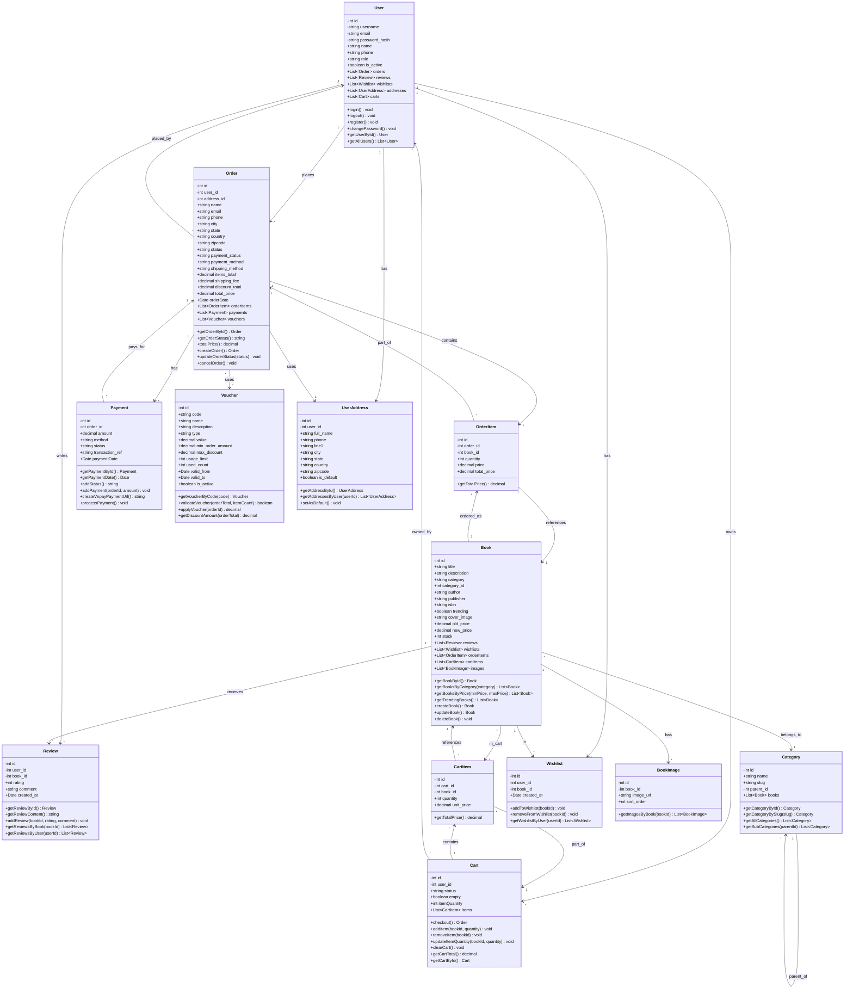

# Book Store - UML Class Diagram

## Class Diagram (Mermaid Format)

## Cách sử dụng:

### 1. PlantUML (File: `Class_Diagram.puml`)
- Mở file `backend/Class_Diagram.puml`
- Sử dụng:
  - **Online**: http://www.plantuml.com/plantuml/uml/
  - **VS Code**: Cài extension "PlantUML"
  - **IntelliJ/WebStorm**: Có sẵn plugin PlantUML
  - **Command line**: `java -jar plantuml.jar Class_Diagram.puml`

### 2. Mermaid (File: `Class_Diagram.md`)
- File này có thể xem trực tiếp trong:
  - GitHub (render tự động)
  - VS Code với extension "Markdown Preview Mermaid Support"
  - https://mermaid.live/
  - Các markdown viewers hỗ trợ Mermaid

## So sánh với FurniScape Diagram:

| FurniScape | Book Store |
|------------|------------|
| User | User |
| Product | Book |
| Comment | Review |
| Cart | Cart |
| Order | Order |
| Order Detail | OrderItem |
| Payment | Payment |
| - | Voucher (thêm) |
| - | Category (thêm) |
| - | Wishlist (thêm) |
| - | UserAddress (thêm) |
| - | BookImage (thêm) |
| - | CartItem (thêm) |

## Relationships:

- **Association**: User → Order, User → Review, Book → Review
- **Composition** (filled diamond): Order → OrderItem, Order → Payment, Cart → CartItem, Book → BookImage
- **Aggregation**: User → Cart, Book → Category
- **Many-to-Many**: Order ↔ Voucher (qua order_vouchers table)

