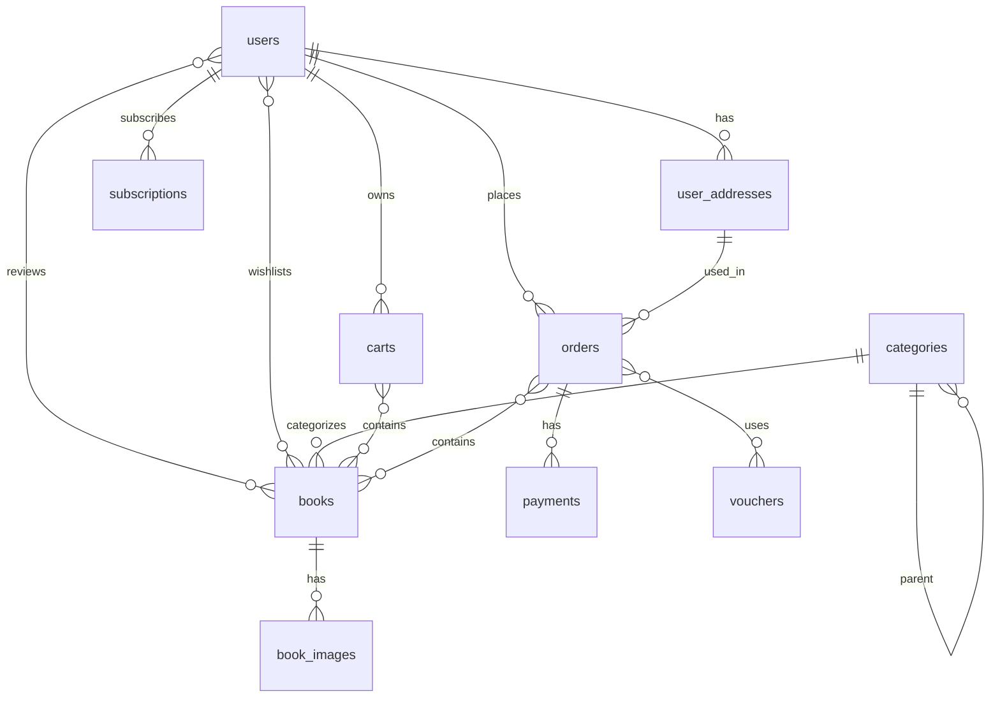

# Book Store Database - Entity Relationship Diagram

## Database Schema Summary

### Core Tables (10 main tables)

1. **users** - User accounts with authentication
2. **user_addresses** - Multiple shipping addresses per user
3. **subscriptions** - Email subscription management

### Product Tables
4. **categories** - Hierarchical book categories (self-referential)
5. **books** - Book products with pricing and inventory
6. **book_images** - Multiple images per book

### Shopping Tables
7. **carts** - Shopping carts (ACTIVE/ORDERED/ABANDONED)
   - *Quan hệ N-N với books* (cart_items: quantity, unit_price)

### Order Tables
8. **orders** - Customer orders with shipping info snapshot
   - *Quan hệ N-N với books* (order_items: quantity, price, total_price)
   - *Quan hệ N-N với vouchers* (order_vouchers: discount_amount)
9. **payments** - Payment transaction records
10. **vouchers** - Discount coupons and promotions

### User Interactions
- *Quan hệ N-N users ↔ books* cho reviews (rating, comment)
- *Quan hệ N-N users ↔ books* cho wishlists

**Lưu ý**: Các bảng trung gian (cart_items, order_items, order_vouchers, reviews, wishlists) được gộp vào quan hệ N-N trực tiếp trong ERD này để đơn giản hóa. Trong database thực tế, các bảng này vẫn tồn tại để lưu trữ dữ liệu chi tiết.

### Key Features:
- **User Management**: Multi-address support, role-based access (USER/ADMIN)
- **Product Catalog**: Hierarchical categories, multiple images per book
- **Shopping Cart**: Session-based cart with status tracking
- **Order Processing**: Complete order lifecycle with payment tracking
- **Promotions**: Flexible voucher system (percentage, fixed amount, free shipping)
- **User Engagement**: Reviews, ratings, and wishlists
