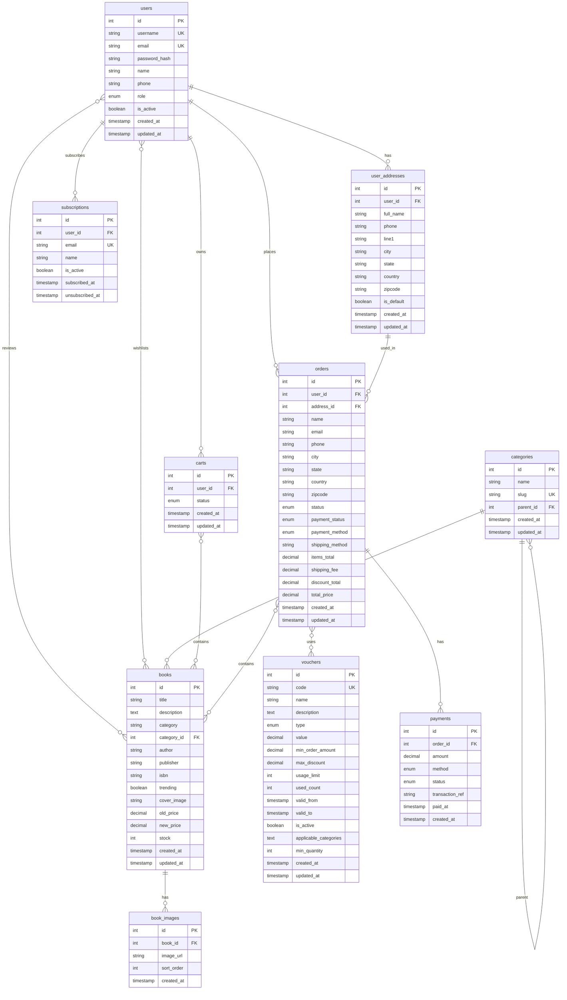
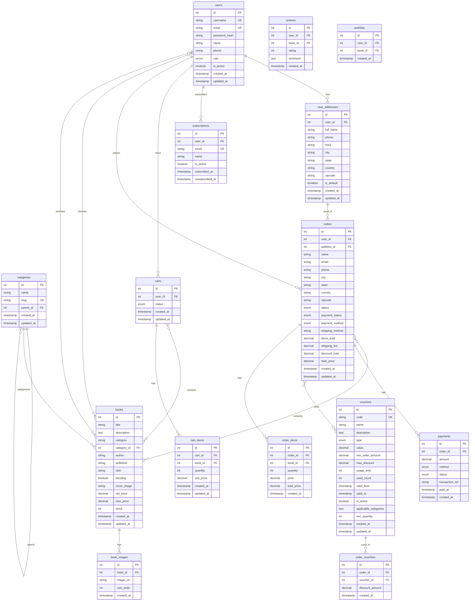

# Book Store Database - Entity Relationship Diagram (Corrected)

## ERD Trừu Tượng với Attributes (Entities chính)

## ERD với đầy đủ Attributes (Bao gồm bảng trung gian)

## Các thay đổi so với phiên bản ban đầu:

1. ✅ **orders ||--o{ payments** (đã sửa từ `||--||` thành `||--o{`)
   - Trong db.sql: `payments.order_id INT NOT NULL` → 1 order có thể có nhiều payments
   - Quan hệ đúng: **1-N** (một order có nhiều payment records)

## Phân tích các quan hệ:

### Quan hệ 1-N (One-to-Many):
- ✅ users → user_addresses (1 user có nhiều địa chỉ)
- ✅ users → subscriptions (1 user có nhiều subscription)
- ✅ users → carts (1 user có nhiều carts)
- ✅ users → orders (1 user có nhiều orders)
- ✅ categories → categories (self-reference, 1 category có nhiều sub-categories)
- ✅ categories → books (1 category có nhiều books)
- ✅ books → book_images (1 book có nhiều images)
- ✅ orders → payments (1 order có nhiều payments) ⚠️ **ĐÃ SỬA**
- ✅ orders → order_items (1 order có nhiều items)
- ✅ carts → cart_items (1 cart có nhiều items)
- ✅ vouchers → order_vouchers (1 voucher có thể dùng trong nhiều orders)
- ✅ user_addresses → orders (1 address có thể dùng trong nhiều orders)

### Quan hệ N-N (Many-to-Many) - qua bảng trung gian:
- ✅ users ↔ books (qua reviews)
- ✅ users ↔ books (qua wishlists)
- ✅ carts ↔ books (qua cart_items)
- ✅ orders ↔ books (qua order_items)
- ✅ orders ↔ vouchers (qua order_vouchers)

## Tóm tắt:

ERD của bạn **gần như đúng**, chỉ cần sửa 1 chỗ:
- ❌ `orders ||--|| payments` → ✅ `orders ||--o{ payments`

Tất cả các quan hệ khác đều hợp lý với db.sql!

